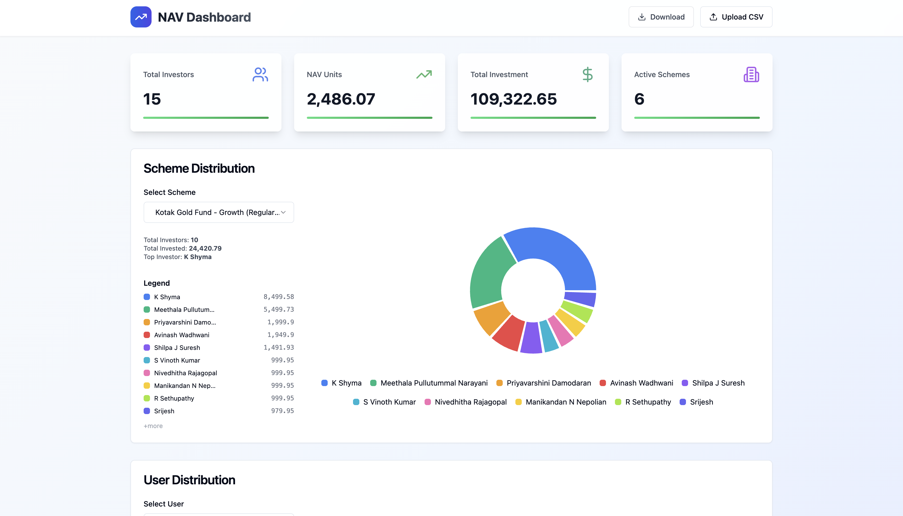

# Financial Transactions Dashboard

Production-style analytics system for ingesting, aggregating, and visualizing financial transaction data.



## What this project demonstrates

- Ingesting and normalizing messy financial CSV data  
- Async-safe aggregation and analytics over transactional records  
- Backend-first system design with clear separation of concerns  
- Production-minded validation, schema evolution, and reporting  

## System Overview

- **Backend:** FastAPI with async SQLAlchemy and PostgreSQL  
- **Data ingestion:** CSV upload pipeline with schema validation and type coercion  
- **Analytics:** Scheme-level and user-level aggregation APIs  
- **Frontend:** React dashboard for interactive exploration  
- **Reporting:** PDF generation for offline analysis  

## Key Engineering Decisions

- Bulk inserts for high-volume CSV ingestion  
- Explicit schema validation to fail fast on malformed data  
- Async database access for analytics-heavy endpoints  
- Repository / service layering to isolate business logic  

## Production Considerations

- Dockerized local environment  
- Automated backend and frontend tests  
- Clear extension points for auth, background jobs, and idempotency  

---

## Running with Docker Compose

### Prerequisites

- Docker installed  
- Docker Compose (if not included with Docker)

### Steps

1. Open a terminal in the project root directory (where `docker-compose.yaml` is located).

2. Build and start the services:

   ```sh
   docker compose up --build -d
   ```

   This will start:
   - **Postgres** database (port 5432)
   - **Alembic** migration service (runs automatically)
   - **App** backend (FastAPI, port 8000)
   - **UI** frontend (React, port 3000)

3. Wait for services to be ready (migrations and database initialization):

   ```sh
   docker compose logs -f
   ```

   Press `Ctrl+C` to exit logs once all services show as healthy.

4. Access the application:
   - **API**: [http://localhost:8000](http://localhost:8000)
   - **API Docs**: [http://localhost:8000/docs](http://localhost:8000/docs)
   - **UI**: [http://localhost:3000](http://localhost:3000)

### Useful Commands

**View logs:**
```sh
docker compose logs -f
```

**View logs for a specific service:**
```sh
docker compose logs -f app
docker compose logs -f frontend
docker compose logs -f postgres
```

**Stop services (keeps data):**
```sh
docker compose down
```

**Stop and remove all data (containers, networks, and volumes):**
```sh
docker compose down -v
```

**Restart a specific service:**
```sh
docker compose restart app
```

**Rebuild after code changes:**
```sh
docker compose up --build -d
```